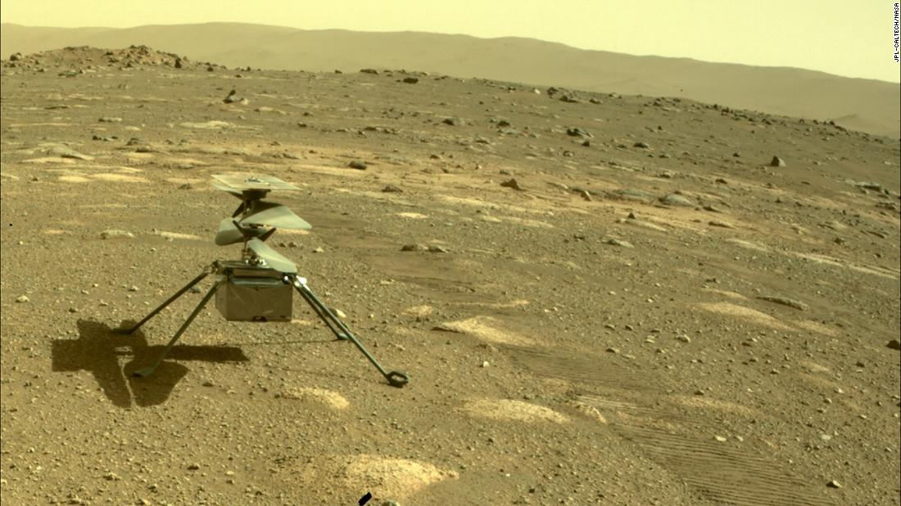

# NASA’s Ingenuity drone on Mars survives its first night before its test flight

Despite the frigid conditions of Mars, NASA’s Ingenuity helicopter that detached from the Perseverance rover survived one night on the planet’s surface. Ingenuity will soon take off for its first flight and could potentially fly on April 11th. This event could reveal to the world **actual footage** from the surface of Mars at a bird’s-eye view for the _first_ time in history. [CNN’s report](https://www.cnn.com/2021/04/05/world/mars-helicopter-ingenuity-nasa-rotorcraft-scn-trnd/index.html) details the harsh conditions Ingenuity had to endure:

> Jezero Crater, an ancient lake bed on Mars and the current site of the Perseverance rover and Ingenuity helicopter, can drop to temperatures of minus 130 degrees Fahrenheit. That's low enough to do significant damage to the helicopter's electrical and battery components.

Other highlights:

- [Ingenuity’s flight](https://www.space.com/mars-helicopter-ingenuity-first-flight-preview) will last around 90 seconds
- The drone can perform up to [five test flights](https://www.cnn.com/2021/04/05/world/mars-helicopter-ingenuity-nasa-rotorcraft-scn-trnd/index.html)
- There are several [preflight steps](https://abcnews.go.com/Technology/nasas-mars-helicopter-survives-1st-night-set-1st/story?id=76878290&cid=clicksource_4380645_16_post_hero_bsq_image) that the drone must undergo before taking off
